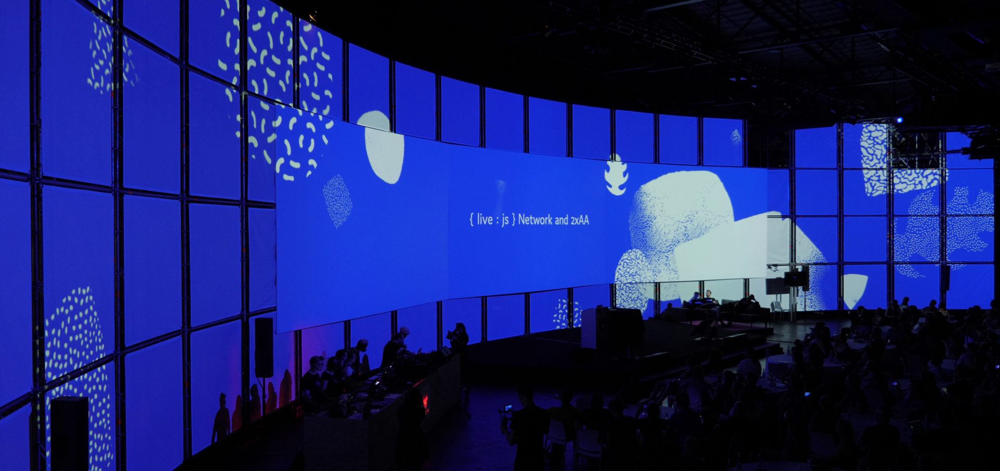
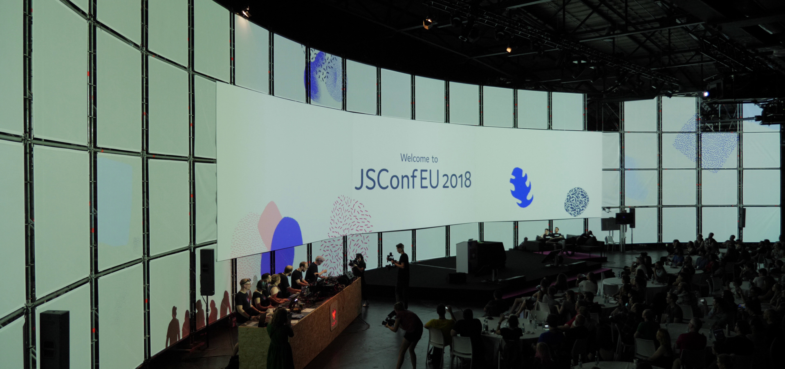
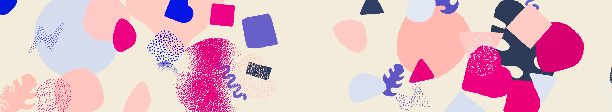
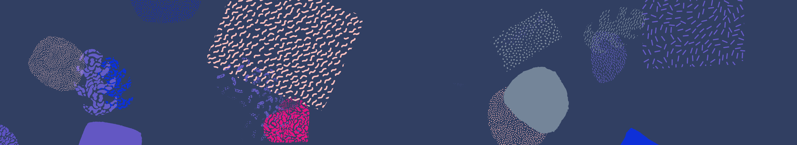
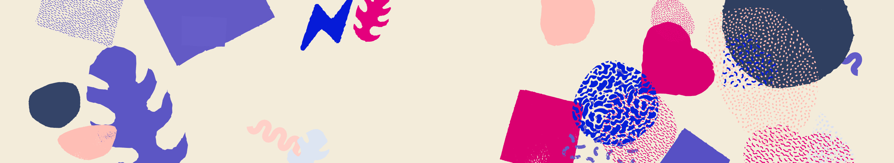

# jsconfeu-generative-visuals

The ThreeJS/WebGL and Canvas code for the real-time generative animations shown during JSConfEU 2018 in Berlin. Created by [Matt DesLauriers](http://mattdesl.com/) and [Szymon Kaliski](http://szymonkaliski.com/), based on [Silke Voigts](http://www.silkevoigts.de/)'s designs and mood boards.

This was used during the opening of the event, as well as during breaks in between talks, and around the edges of speaker slides during talks. The visuals were used in a couple other select places, such as in monitors showing current schedule & speaker tracks. All using Chrome in real-time.

## Photos & Video

For a video of the artwork at JSConfEU, see here:

- [Vimeo: JSConf EU Generative Visuals](https://vimeo.com/273222929)

A couple select photos below:





## Screen Shots

Taken from in browser:

  

  

  

## Live Demo

You can run it here:

## How to Install

Dependencies:

- `node@8.10.0`
- `npm@5.7.1`
- `Chrome 66`

Setup:

```sh
git clone https://github.com/mattdesl/jsconfeu-generative-visuals
cd jsconfeu-generative-visuals
npm install
```

Now, you can run in development mode on [http://localhost:9966/](http://localhost:9966/) with the following:

```sh
npm run start
```

Or, bundle to a static site in the `public/` folder:

```sh
npm run build
```

In our final projection mapping, we ended up building this to a standalone library that was required by a larger framework to control other visualizations on the projection surface.

## Implementation Details

The main projection uses an aspect ratio of 6540x1200px, four projectors connected to a single GeForce GTX 1080 Windows PC running Chrome in full-screen.

The shapes are triangulated and rendered with WebGL, using vertex shaders to give them organic movement. An algorithm similar to dart throwing is used to spawn shapes in a pleasing composition, and a slow-motion physics engine repels shapes away from the centre screens if they drift too close. WebAudio and FFT analysis to the intro audio affects the dancing and shifting of the shapes. Most features of the artwork — geometry, pattern, scale, colour selection, movement, etc — are randomized with hand-tuned probabilities.

## Credits

This was made possible by the entire JSConfEU team and conference, as well as the support from their sponsors, including Google Chrome.

The generative visuals were made possible by the following members:

- Matt DesLauriers – generative art, creative coding, video editing
- Szymon Kaliski – creative coding
- Martin Mostert – cinematography, film footage
- Martin Schuhfuss – lights, projection mapping
- Malte Ubl – curator, JSConf EU
- Silke Voigts – design, brand identity
- Sam Wray (2xAA) – soundtrack

Also thanks to the rest of the live:js, Nested Loops, JSConf EU and CSSConf EU teams.

## License

MIT, see [LICENSE.md](http://github.com/mattdesl/jsconfeu-generative-visuals/blob/master/LICENSE.md) for details.
